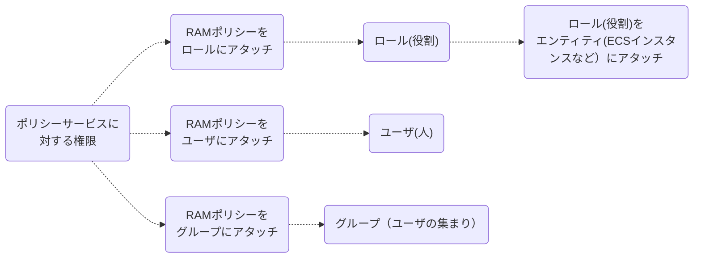

AAlibabaCloudはどのサービスを利用・操作するにしろ権限が必要です。
Terraformで作成したリソースサービスにも他ユーザが操作できるように権限アタッチが必要になります。
本章では、AlibabaCloudサービスに対する権限付与の方法を学びます。

## 5.1 Alibaba CloudのRAMについて
RAM（Resource Access Management）はユーザーID の管理とアクセス制御、権限管理のためのサービスです。
RAMを使用することで、ユーザーアカウント (従業員、システム、アプリケーションなど) を作成および管理し、Alibaba Cloud アカウントのリソースに対してそのユーザーアカウントが所有する操作権限を制御できます。Terraformによるリソースを実行するときはRAMで実行権限が必須です。

## 5.2 RAMロールとRAMユーザーの違い
・RAMロールは仮想ID であり、固定のIDは持っていますが、ID認証情報アクセスキーを持ちません。
・RAMユーザは、固定のIDとID認証アクセスキーを持つ実際のIDであり、一般的には、特定のユーザーまたはアプリケーションに対応します。



RAMロールは権限が付与された実際のユーザーが引き受ける必要があります。ロールを引き受けると実際のユーザーはこのRAMロールの一時セキュリティトークンを受け取ります。これにより、この一時セキュリティトークンを使用して、ロールに許可されているリソースにアクセスできます。

普段の利用時はRAMユーザで管理・運用していくのがベストプラクティスですが、Terraform利用時は基本的にAdministratorAccessが必要となります。


## 5.3 ポリシー 
権限はポリシーで定義します。ポリシーでは「実行可能なアクション」や「操作可能なリソース」を指定でき、柔軟に権限が設定できます。

### 5.3.1 ポリシードキュメント
ポリシードキュメントはJSON形式で管理しており、リスト5.3.1.1のようにまとめます。
▼リスト 5.3.1.1 JSON 形式のポリシードキュメント
```
{
  "Statement": [
    {
      "Action": "*",
      "Effect": "Allow",
      "Resource": "*"
    }
  ],
  "Version": "1"
}
```
ポリシードキュメントでは、次のような要素を記述します。
* `Effect` - 許可する場合はAllow、許可しない場合はDeny
* `Resource` - AlibabaCloudの操作可能なリソース・許可されたオブジェクトはなにかを指定します。たとえば ”ユーザAがリソースSampleBucketに対してGetBucket操作を実行できる” という権限付与ポリシーの場合、Resourceは`SampleBucket` です。
* `Action` - AlibabaCloudの各種サービスでどんな操作が実行できるか。サービスを個別指定することも可能。たとえば ”ユーザAがリソースSampleBucketに対してGetBucket操作を実行できる” という権限付与ポリシーの場合、Actionは`GetBucket` です。
* `Condition` - 権限付与が有効になる条件です。たとえば、”ユーザAが2018年12月31日より前にリソース SampleBucketに対してGetBucket操作を実行できる” という権限付与ポリシーの場合、Conditionは `2018年12月31日より前` です。


他の例もみてみましょう。
”リクエスト送信者のソースIPアドレスが 42.160.1.0であれば、SampleBucketというOSSバケットに対して読み取り専用操作を実行できる” というRAMポリシーであれば、リスト5.3.1.2のようにまとめます。
▼リスト 5.3.1.2 JSON 形式のポリシードキュメント
```
{
    "Version": "1",
    "Statement":
    [{
        "Effect": "Allow",
        "Action": ["oss:List*", "oss:Get*"],
        "Resource": ["acs:oss:*:*:samplebucket", "acs:oss:*:*:samplebucket/*"],
        "Condition":
        {
            "IpAddress":
            {
                "acs:SourceIp": "42.160.1.0"
            }
        }
    }]
}
```

### 5.3.2 RAM ポリシー
ポリシードキュメントを保持するリソースが「RAM ポリシー」です。リスト5.3のように、ポリシー名とポリシードキュメントを設定します。

▼リスト 5.3 RAM ポリシーの定義
```
resource "alicloud_ram_policy" "terraform_example" {
   name   = "terraform_example"
   policy = data.alicloud_ram_policy_document.allow_describe_regions.json
}
```

## 5.4 RAM ポリシーの作成
ここまではRAMポリシーの基本的なことを記載しました。それではTerraformによるRAMポリシーの作成をします。
例として、リスト5.4のように `test_policy` というRAMポリシー名で、mybucket というOSSバケットに対して読み取り専用操作を実行できるという権限ルールを新しく作成します。

▼リスト 5.4 `test_policy` RAM ポリシーの定義
```
resource "alicloud_ram_policy" "policy" {
  name = "test_policy"
  statement = [
    {
      effect = "Allow"
      action = [
        "oss:ListObjects",
        "oss:GetObject"
      ]
      resource = [
        "acs:oss:*:*:mybucket",
        "acs:oss:*:*:mybucket/*"
      ]
    }
  ]
  description = "this is a policy test"
  force = true
}
```
上記で記載したRAMポリシー以外にオプション（任意）で他ルールらパラメータや構成を指定することもできます。
* `name` - （必須）RAMポリシーの名前。
* `statement`- （必須）RAMポリシードキュメントのステートメント。
* `resource` - （必須）許可される特定のオブジェクト。
* `action` - （必須）resourceに対するどんな操作が許可されてるか。
* `effect` - （必須）actionが許可されているかどうかを示します。有効な値はAllowand Denyです。
* `version` - （オプション）RAMポリシードキュメントのバージョン。デフォルト値は1です。
* `description` - （オプション）RAMポリシーの説明。
* `force` - （オプション）このパラメータはリソースの破棄に使用されます。デフォルト値はfalseです。

このリソースを実行することにより、以下の属性情報が出力されます。

* `id` - ポリシーID
* `name` - ポリシー名
* `type` - ポリシータイプ。
* `description` - ポリシーの説明
* `statement` - 政策文書のステートメントのリスト。
* `document` - ポリシー文書
* `version` - ポリシー文書のバージョン。
* `attachment_count` - ポリシー添付ファイル数。


その他、詳しくは[AliCloudのterraform-RAM](https://www.terraform.io/docs/providers/alicloud/r/ram_policy.html)を参照してみてください。


## 5.5 RAMロールを作成し、RAMポリシーへアタッチ
今度は別のパターン、RAMロールを作成し、RAMポリシーへアタッチしてみます。
例として、`test_role`というRAMロールを作成し、これを`test_policy`というRAMポリシーへアタッチします。
アタッチするときは`alicloud_ram_role_policy_attachment`という構文を使います。

```
resource "alicloud_ram_role" "role" {
  name = "test_role"
  ram_users = ["acs:ram::${your_account_id}:root", "acs:ram::${other_account_id}:user/username"]
  services = ["apigateway.aliyuncs.com", "ecs.aliyuncs.com"]
  description = "this is a role test."
  force = true
}


resource "alicloud_ram_policy" "policy" {
  name = "test_policy"
  statement = [
          {
            effect = "Allow"
            action = [
              "oss:ListObjects",
              "oss:GetObject"]
            resource = [
              "acs:oss:*:*:mybucket",
              "acs:oss:*:*:mybucket/*"]
          }]
  description = "this is a policy test"
  force = true
}

resource "alicloud_ram_role_policy_attachment" "attach" {
  policy_name = "${alicloud_ram_policy.policy.name}"
  policy_type = "${alicloud_ram_policy.policy.type}"
  role_name = "${alicloud_ram_role.role.name}"
}
```
この`alicloud_ram_role_policy_attachment`リソースで必要なパラメータは以下3点です。

* `role_name` - （必須）RAMロールの名前。
* `policy_name` - （必須）RAMポリシーの名前。
* `policy_type` - （必須、ForceNew）RAMポリシーの種類

このリソースを実行することにより、以下の属性情報が出力されます。

* `id` - 添付ファイルID。
* `role_name` - ロール名
* `policy_name` - ポリシー名
* `policy_type` - ポリシータイプ。

その他、詳しくは[AliCloudのterraform-RAMポリシーへのアタッチ](https://www.terraform.io/docs/providers/alicloud/r/ram_role_policy_attachment.html)を参照してみてください。


## 5.6 RAMポリシーを対象リソース・サービスへアタッチ
ここまで、RAMポリシー`test_role`を作成したら、今度は対象のリソース・サービスにアタッチしてみます。ここは`ECS_instance`らECSインスタンスへアタッチしてみます。
アタッチするときは`alicloud_ram_role_attachment`構文を使います。

```
resource "alicloud_ram_role" "role" {
  name = "test_role"
  services = ["apigateway.aliyuncs.com", "ecs.aliyuncs.com"]
  ram_users = ["acs:ram::${your_account_id}:root", "acs:ram::${other_account_id}:user/username"]
  description = "this is a role test."
  force = true
}

resource "alicloud_instance" "ECS_instance" {
  instance_name   = "ECS_instance_for_terraform"
  host_name       = "ECS_instance_for_terraform"
  instance_type   = "ecs.n4.small"
  image_id        = "centos_7_04_64_20G_alibase_201701015.vhd"
  system_disk_category = "cloud_efficiency"
  security_groups = ["${alicloud_security_group.sg.id}"]
  availability_zone = "${var.zone}"
  vswitch_id = "${alicloud_vswitch.vsw.id}"
}

resource "alicloud_ram_role_attachment" "attach" {
  role_name = "${alicloud_ram_role.role.name}"
  instance_ids = ["${alicloud_instance.ECS_instance.id}"]
}
```

[ECSアタッチでより詳しくはこちら](https://www.terraform.io/docs/providers/alicloud/r/ram_role_attachment.html)を参照してみてください。


